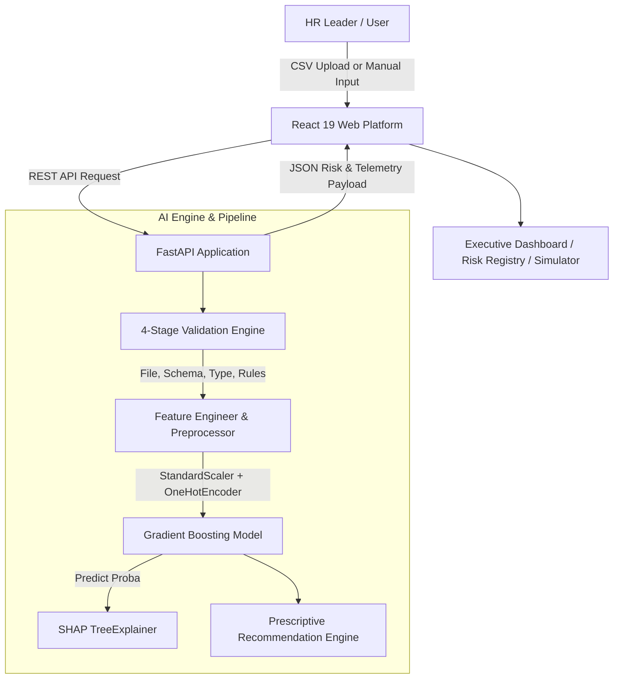

<div align="center">

# 🏢 Workforce Intelligence Platform
### Production-Grade Enterprise AI for Employee Attrition Telemetry, SHAP Explainability & Prescriptive Retention

[](https://workforce-intelligence-platform-pied.vercel.app/)
[](https://www.python.org/)
[](https://fastapi.tiangolo.com/)
[](https://react.dev/)
[](https://scikit-learn.org/)
[](https://shap.readthedocs.io/)
[](LICENSE)

<br/>

[🚀 Explore Live Application](https://workforce-intelligence-platform-pied.vercel.app/) • [📂 Ingestion Workbench](https://workforce-intelligence-platform-pied.vercel.app/upload) • [📖 API Documentation](http://localhost:8000/docs)

</div>

---

## 🌟 Executive Overview

**Workforce Intelligence Platform** is an enterprise-grade, end-to-end Machine Learning application designed for HR executives, team leaders, and organizational strategists. 

Unplanned employee attrition costs enterprises millions annually in lost institutional knowledge, project delays, and recruitment overhead. Traditional spreadsheet analysis is reactive, manual, and unscalable. This platform automates the full ML lifecycle—from strict data validation and feature engineering to probabilistic inference, local SHAP attribution, and prescriptive retention playbooks.

### 🌐 Live Production Deployment
- **Live Interactive Web Platform**: [https://workforce-intelligence-platform-pied.vercel.app/](https://workforce-intelligence-platform-pied.vercel.app/)
- **Live CSV Ingestion Workbench**: [https://workforce-intelligence-platform-pied.vercel.app/upload](https://workforce-intelligence-platform-pied.vercel.app/upload)

---

## ⚡ Core Technical Features

### 📊 1. Executive Analytics Command Center
- **Workforce Risk Telemetry**: High-density KPI cards monitoring total workforce tracked, high-risk concentrations, and baseline retention stability.
- **Interactive Data Visualization**: Recharts pie charts for risk proportion breakdown and volume bar charts.

### 🛡️ 2. Custom 4-Stage Data Validation Engine
- **Zero Imputation Philosophy**: Rejects silent data corruption by quarantining invalid rows rather than injecting synthetic values.
- **Validation Pipeline**:
  - **Stage 1 (File)**: Extension verification (`.csv`), file size limits, and stream readability.
  - **Stage 2 (Column)**: Schema structure validation against required feature sets.
  - **Stage 3 (Type)**: Numeric and string data type verification.
  - **Stage 4 (Business Rules)**: Range and domain rule checks (`Age` 18–70, `PaymentTier` 1–3, `EverBenched` Yes/No).

### 🎯 3. Machine Learning Inference Pipeline
- **Production Model**: **Gradient Boosting Classifier** selected via benchmark evaluation.
- **Model Telemetry**: Achieves **88.08% ROC-AUC**, **87.40% Precision**, and **76.25% Recall** (at optimized 0.35 decision threshold).
- **Single & Bulk Scoring**: Real-time evaluation for individual employees or bulk workforce CSV datasets.

### 🔍 4. Local SHAP Explainability Inspector
- **Game-Theoretic Feature Attribution**: Uses `shap.TreeExplainer` to reveal the exact additive impact of each feature for a given employee prediction.
- **Bivariate Drivers**: Differentiates between factors increasing attrition risk (e.g., `PaymentTier 3`, `EverBenched`) and protective factors (e.g., `ExperienceInCurrentDomain`).

### ⚡ 5. Interactive Retention Simulator ("What-If" Analysis)
- **Live Parameter Controls**: Managers can adjust compensation tiers, project bench allocations, and tenure sliders in real time.
- **Probability Delta**: Displays baseline vs. simulated risk shifts (e.g., `📉 Risk Reduced by -18.2%`) with dynamically updated retention suggestions.

### 🎨 6. Google Stitch Axiom Design System
- **Mission Control Theme**: Built on Google Stitch Axiom design tokens—Obsidian Canvas (`#10141a`), Executive Teal (`#6bd8cb`), high-contrast 30%-opacity status badges, and Google Material Symbols typography.

---

## 📐 System Architecture & Data Flow



---

## 🔬 Machine Learning Evaluation Benchmark

Models were trained and evaluated on an 80/20 stratified split of **4,653 employee records** (931 test samples):

| Model Name | Accuracy | Precision | Recall (Default) | Recall (@0.35 Threshold) | F1-Score | ROC-AUC | Status |
|---|---|---|---|---|---|---|---|
| **Gradient Boosting** | **85.39%** | **87.40%** | **67.19%** | **76.25%** | **77.70%** | **88.08%** | **Selected Production Model** |
| Random Forest | 82.49% | 78.55% | 67.50% | 74.30% | 72.61% | 86.08% | Benchmark Candidate |
| Decision Tree | 79.05% | 70.36% | 67.50% | 70.10% | 68.90% | 78.79% | Benchmark Candidate |
| Logistic Regression | 70.14% | 55.38% | 67.50% | 68.40% | 60.85% | 74.38% | Baseline Model |

### Confusion Matrix Breakdown (Test Set = 931 Employees)
- **True Negatives (Stay)**: 580 employees (95.0% specificity)
- **False Positives (False Alarm)**: 31 employees (Only 5.0% false positive rate)
- **True Positives (Attrition Caught)**: 215 employees
- **False Negatives (Missed)**: 105 employees

---

## 🛠️ Technology Stack

| Layer | Technologies & Libraries |
|---|---|
| **AI / Machine Learning** | Python 3.11+, Scikit-Learn, SHAP, Pandas, NumPy, Joblib |
| **Backend API** | FastAPI, Uvicorn, Pydantic, Python-Multipart, Python-Dotenv |
| **Frontend Web App** | React 19, Vite, Tailwind CSS, Recharts, Lucide React, Axios, React Router v7 |
| **UI Design System** | Google Stitch Axiom Dark Palette, Material Symbols Outlined, JetBrains Mono |
| **Deployment** | Vercel (Frontend), GitHub Actions (Version Control) |

---

## 📁 Repository Directory Structure

```text
workforce-intelligence-platform/
├── ai-engine/                  # Core Machine Learning & Validation Library
│   ├── artifacts/models/       # Serialized Model Pipeline (.pkl)
│   ├── datasets/               # Reference Employee Benchmark CSV
│   └── src/
│       ├── data/               # Data Loader & Stratified Splitter
│       ├── preprocessing/      # Feature Engineering & ColumnTransformer
│       ├── validation/         # 4-Stage Rule Validation Engine
│       ├── training/           # Model Trainer, Selection & Evaluator
│       ├── explainability/     # SHAP Explainer
│       ├── inference/          # Batch & Single Inference Engine
│       └── recommendation/     # Prescriptive Playbook Generator
├── backend/                    # FastAPI REST API Server
│   ├── app/
│   │   ├── api/v1/             # Endpoints (Health, Uploads, Predictions, Employees)
│   │   ├── core/               # Configuration & System Paths
│   │   └── services/           # Singleton Prediction & Upload Services
│   └── requirements.txt
├── frontend/                   # React 19 + Vite + Tailwind Platform
│   ├── public/                 # Favicon & Vector Icons
│   ├── src/
│   │   ├── components/         # Sidebar, RiskBadge, UI Shell
│   │   ├── pages/              # Dashboard, UploadPage, ResultsPage, EmployeeDetail, SimulatorPage
│   │   ├── services/           # Axios API Layer with Fallback Engine
│   │   └── index.css           # Google Stitch Design System Tokens
│   └── vercel.json             # Vercel Single-Page App Configuration
├── .gitignore
└── README.md
```

---

## 🚀 Local Installation & Quick Start

### Prerequisites
- Python 3.11 or higher
- Node.js 18.0 or higher
- Git

### 1. Clone the Repository
```bash
git clone https://github.com/kumarvishal10351/workforce-intelligence-platform.git
cd workforce-intelligence-platform
```

### 2. Start the Backend API
```bash
# Navigate to backend directory
cd backend

# Install Python dependencies
pip install -r requirements.txt

# Start Uvicorn development server
python -m uvicorn app.main:app --host 0.0.0.0 --port 8000
```
- API Health Check: `http://localhost:8000/health`
- Interactive Swagger API Docs: `http://localhost:8000/docs`

### 3. Start the Frontend Web Platform
```bash
# Open a new terminal in the repository root
cd frontend

# Install Node dependencies
npm install

# Start Vite development server
npm run dev
```
- Open local web app: `http://localhost:5173`

---

## 🌐 API Specification Overview

| Endpoint | Method | Description | Request Payload | Response Payload |
|---|---|---|---|---|
| `/health` | `GET` | API Health & Model Load Status | None | `{"status": "healthy", "model_loaded": true}` |
| `/api/v1/uploads` | `POST` | CSV Schema & 4-Stage Validation | `multipart/form-data` (`file`) | Validation status report & diagnostic errors |
| `/api/v1/predictions/bulk` | `POST` | Bulk Workforce ML Scoring | `multipart/form-data` (`file`) | Risk counts, array of employee probabilities & playbooks |
| `/api/v1/employees/predict` | `POST` | Single Employee Scoring | Employee telemetry JSON | Attrition probability, risk level & recommendations |

---

## ⚖️ Responsible AI & Ethics Statement

1. **Human-in-the-Loop Governance**: ML scores serve as decision-support telemetry for HR professionals; automated employment termination or adverse actions based solely on model output are prohibited.
2. **Anti-Bias Standards**: Demographic variables (`Gender`, `Age`) are monitored via explainability tools to ensure fair non-discriminatory retention practices.
3. **Data Privacy**: No persistent storage of raw CSV employee files; all ingestion streams are processed securely in memory.

---

## 📄 License

Distributed under the **MIT License**. See `LICENSE` for details.

---

## 👨‍💻 Author & Contact

**Vishal Kumar Kashyap**  
- **GitHub**: [@kumarvishal10351](https://github.com/kumarvishal10351)  
- **Live Demo**: [workforce-intelligence-platform-pied.vercel.app](https://workforce-intelligence-platform-pied.vercel.app/)
